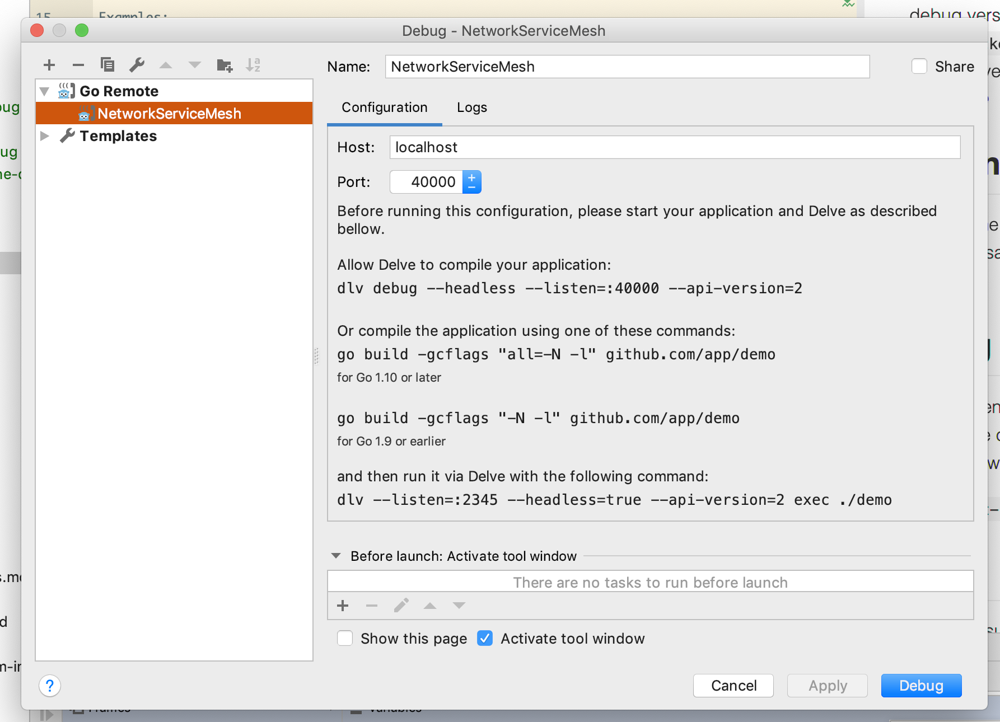
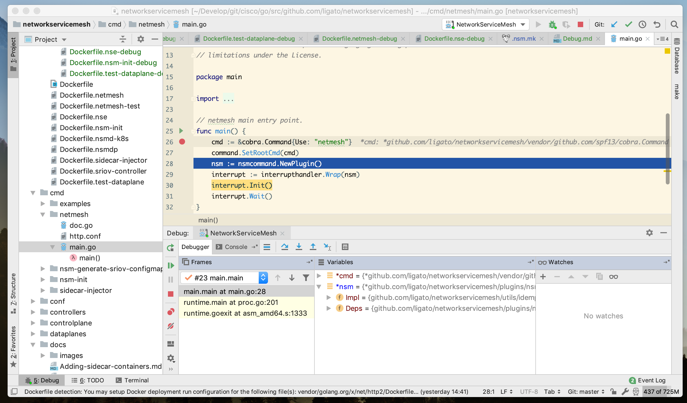

# Network Service Mesh - Go Debug Guide

A short guide to debug Go code inside Kubernetes.

Debug is done using [Delve](http://github.com/derekparker/delve)

## One node debug

One node debug is done inside one Docker container with files synchronized with docker env.

### Developer environment docker image

To build a docker dev environment container image, use:

```bash
make docker-devenv-save
```

This container is used to build DLV and have all necessary dependencies + have file synchronized via volume to a
current directory, so NSM sources are required.

It builds a `./docker/debug/Dockerfile.debug` and produces `networkservicemesh/devenv` image.

### Running a dev container to host apps

After building the base image, it could be used to start one or more debug containers.
Right now for single-node experience it would be good to have one container - this container forward ports 40000-40100
to local host.

This will bring up the dev container: 

```bash
make docker-devenv-run
```

and will allow us to start one or more applications under debug and have a local connection with the IDE.

After the docker image is started, it execute the `./scripts/debug_env.sh` script to setup all required dependencies,
check for deps and call `go generate` to generate all required code.

You should receive the following output:

```
user /go/src/github.com/networkservicemesh/networkservicemesh $ make docker-devenv-run
Starting NSC DevEnv dummy application

********************************************************************************
          Welcome to NetworkServiceMesh Dev/Debug environment
********************************************************************************
Please use docker run debug.sh app to attach and start debug for particular application
#You could do Ctrl+C to detach from this log.
```

Container is executed in detached mode, and logs are tailed, so after it completes, we could Ctrl+C to detach from logs.

#### Useful script ./scripts/debug.sh

It allows to start one the components in `debug` mode, since codebase is synchronized every call will compile
actual code, so every restart will start the last code into debug.

#### Useful script ./scripts/run.sh 

It allows to start one the components in `run` mode, since codebase is synchronized every call will compile
actual code, so every restart will start the last code.

### Debug components

Alternative to `debug.sh` script, we could do a command from the host, like:

`make docker-X-debug`

This will connect to docker image and execute `debug.sh X` that will start debugging a particular component.

For example:

```bash
make docker-nsm-init-debug
Compile and start debug of ./side-cars/cmd/nsm-init/init.go at port 40001
```

This way we can connect via remote debugger to local port 40001.

Another examples are:

* `make docker-nsmd-debug` - debug *controlplane/cmd/nsmd*
* `make docker-nsm-init-debug` - debug *side-cars/cmd/nsm-init*
* `make docker-icmp-responder-nse-debug` - debug *test/applications/cmd/nse/icmp-responder-nse*

### Stopping a debug container

Use `make docker-devenv-kill` to stop debug container.

## Debug in Kubernetes

### Steps

Since devenv require sources to be mapped, Vagrant is modified to map sources into containers and into docker containers.

1. Build a devenv image using `make docker-devenv-build`
2. Startup vagrant and load images inside it.
    1. `make vagrant-start`
    2. `make docker-devenv-save` - save image
    3. `make vagrant-devenv-load-images` - load image into docker
3. Modify/Copy config in `k8s/conf/` for app and add volumes for `sources` and change image to `networkservicemesh/devenv`
    `k8s/conf/debug/nsmd-debug.yaml` could be used as example.
4. If app was deployed to Kubernetes, please delete the appropriate configuration and apply configuration with debug image.
5. In one terminal, we could attach to container and start to debug.  
    `make k8s-nsmd-debug`  - it will execute `debug.sh` inside container and will print a port to attach to.
6. In a second terminal, we need to proxy the port. You can use `make k8s-nsmd-forward port=40000` to forward a port from container. Please refer to `scripts/debug.sh` for ports.
7. Attach to the local port from IDE.

> Step 5 could be repeated since the code is in sync, so there's no need to re-deploy any other components.

## Debug of integration tests.

Using `devenv` infrastructure it is easy to do debug for NSMD/NSMDp/NSMDk8s pods directly from integration tests.
To support this please set env variable NSMD_HOST_ROOT to point to host root if kubernetes has access to host system for docker volumes,
or do not pass this env variable to use vagrant mapped default value in case of vagrant.

In integration test please create NSMD with following options:

```go
nodes := utils.SetupNodesConfig(k8s, 1, defaultTimeout, []*pods.NSMgrPodConfig{
    &pods.NSMgrPodConfig{Nsmd:pods.NSMgrContainerRun, Namespace: k8s.GetK8sNamespace()},
})
```

* NSMgrContainerRun - execute run.sh for nsmd/etc.
* NSMgrContainerDebug - execute debug.sh for nsmd/etc.

### IDEs

Few IDEs support Delve

#### Visual Studio Code

TODO:

#### Goland IDE

1. Go to menu: `Run -> Debug -> Edit configurations...` and add `Go Remote`.
2. In the dialog, specify port `40000` as debug target and host `localhost` since we will forward a port.
    
3. Click debug and we should be ready.

