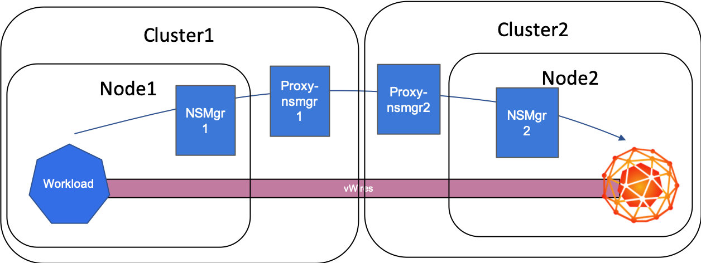
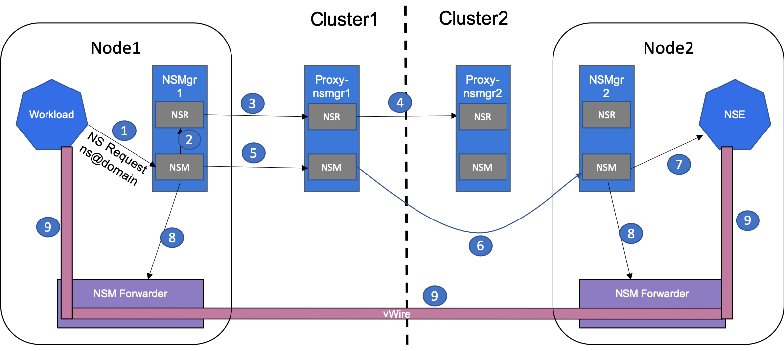
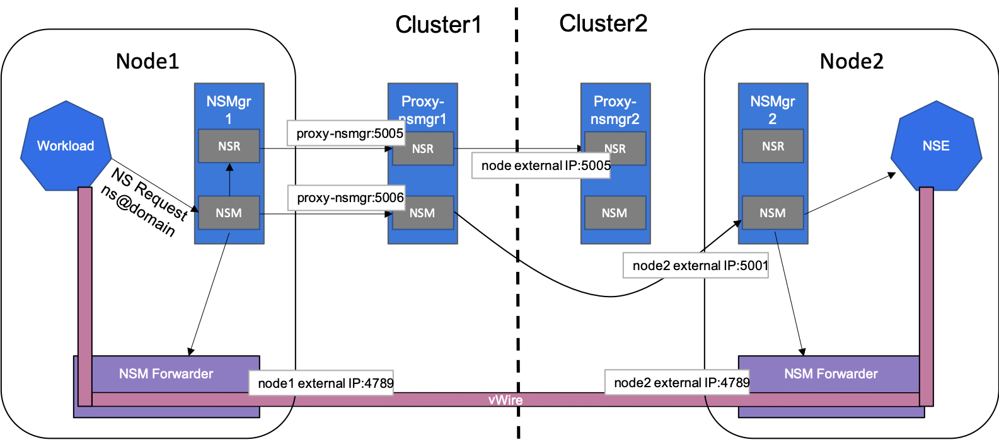

# Interdomain NSM

The NSM interdomain functionality provides the ability for clients in one domain to connect
to endpoints in another domain.  Each domain has its own installation of NSM and domain specific
configuration such that all the NSM control-planes are able to communicate with the NSM components
required for connection setup.

## Architecture



### Proxy NSMgr

The Proxy NSMgr is the component that proxies local cluster API calls to other
NSM domains and handles proxied API calls from other NSM domains.  It performs the following functions:

1. For other domains' network-services, proxy NSR FindNetworkService requests to domain proxy NSRs.
1. For local domain network-services, respond to FindNetworkService requests with NS endpoint information with
   the endpoints' NS manager info converted to externally reachable URLs, e.g. node external IPs.
1. For other domains' network-services, proxy NSMgr NetworkService requests to other domains' NSMgrs
   to connect to the other domains' NS endpoints.

### Control-Plane Interaction Flow



The above figure describes the interdomain control-plane interactions to create interdomain connections.

* Step 1:  The NS client (workload) issues a NetworkService request for a network-service in another domain
  named `ns@domain`.

* Steps 2-4:  The NS endpoints for the domain are discovered via the local NSR forwarding the request to
  the local proxy NSMgr which, in turn, forwards to the domain specific proxy NSR.

* Steps 5-7:  Show the flow for the NetworkService request to the chosen remote domain NS endpoint.
  The local proxy NSMgr forwards the request to the remote NSMgr for the endpoint.

* Steps 8-9:  Show the dataplane connection setup processing performed upon successful processing of the
  control-plane's NetworkService endpoint connection request.

### NSM Interdomain Component Addressing

In order for NSM components to communicate the domains need to be setup to allow reachability from the
components' clients.  The following figure illustrates the addressing requirements for the default
NSM interdomain feature installation.



As implied by the figure, the environment hosting the "cluster 2" domain MUST allow the access to the
cluster 2 node network from cluster 1.  Specifically, TCP ports 5001 and 5005 for the control-plane
interactions, as well as, UDP port 4789 for the NSM forwarder dataplane (VXLAN) setup.

## Security

With NSM control-plane security enabled, authentication of NSM components must be possible between NSM
domains.  **TODO** describe the setup for this.

## Example Installation

1. In each cluster, install NSM in insecure mode

   ```bash
   $ helm template ${NSMDIR}/deployments/helm/nsm --namespace nsm-system --set insecure="true" | kubectl apply --kubeconfig ${KCONF} -f -
   ```

   - where `${NSMDIR}` is the root directory of the `networkservicemesh` repo
   - where `${KCONF}` is the kubeconfig for the cluster to install NSM

1. In each cluster, install the proxy-NSM in insecure mode

   ```bash
   $ helm template ${NSMDIR}/deployments/helm/proxy-nsmgr --namespace nsm-system --set insecure="true" | kubectl apply --kubeconfig ${KCONF} -f -
   ```

1. In each cluster's cloud networking settings enable access to
   - ingress TCP ports 5000-5006
   - ingress UDP port 4789

   **NOTE**  In clusters created via the NSM make machinery the cloud's firewall rules will
   allow ingress to the clusters' nodes on these ports from any IP.

### ICMP Responder Example on Interdomain NSM

The `ucnf-icmp` example can be used to do a quick validation of the NSM interdomain setup.
Follow this procedure to set it up across 2 NSM domains.

1. Set the following env variables
   - `KCONF1` = the kubeconfig of the first cluster
   - `KCONF2` = the kubeconfig of the second cluster
   - `NSMEXDIR` = the directory of the root of your clone of the [examples repo](https://github.com/networkservicemesh/example)

1. Install the ICMP responder example network-service and NS endpoint in the first cluster.

   ```bash
   $ kubectl apply --kubeconfig ${KCONF1} -f ${NSMEXDIR}/examples/ucnf-icmp/k8s/icmp-responder.yaml
   $ kubectl apply --kubeconfig ${KCONF1} -f examples/ucnf-icmp/k8s/ucnf-endpoint.yaml
   ```

1. From cluster1, get the first node's external IP

   ```bash
   $ clus1_IP=$(kubectl get node --kubeconfig ${KCONF1} -o jsonpath='{.items[0].status.addresses[?(@.type=="ExternalIP")].address}')
   ```

1. Install the NS client in cluster 2 as a client of the network-service in the cluster 1 domain

   ```bash
   $ cat <<EOF | kubectl apply --kubeconfig ${KCONF2} -f -
     apiVersion: apps/v1
     kind: Deployment
     spec:
       selector:
         matchLabels:
           networkservicemesh.io/app: "ucnf-client"
       replicas: 1
       template:
         metadata:
           labels:
             networkservicemesh.io/app: "ucnf-client"
         spec:
           containers:
             - name: kali
               image: tiswanso/kali_testssl:latest
               command: ["/bin/sleep","infinity"]
               imagePullPolicy: IfNotPresent #Always
     metadata:
       name: "ucnf-client"
       namespace: default
       annotations:
         ns.networkservicemesh.io: icmp-responder@${clus1_IP}?app=ucnf-client
     EOF
   ```

1. Check the status of the client

   ```bash
   $ kubectl get pods --kubeconfig ${KCONF2}
   NAME                           READY   STATUS    RESTARTS   AGE
   ucnf-client-6dd894fcbc-dz9jj   3/3     Running   0          31s
   ```

1. Check the status of the NS endpoint

   ```bash
   $ kubectl get pods --kubeconfig ${KCONF1}
   NAME                           READY     STATUS    RESTARTS   AGE
   ucnf-endpoint-5cd96469f8-6b5lm   1/1     Running   0          64m
   ```

1. Get the NSM interface IP from the NS endpoint

   ```bash
   $ kubectl exec -it ucnf-endpoint-5cd96469f8-6b5lm --kubeconfig ${KCONFGKE} bash
   root@ucnf-endpoint-5cd96469f8-6b5lm:~# vppctl
       _______    _        _   _____  ___
    __/ __/ _ \  (_)__    | | / / _ \/ _ \
    _/ _// // / / / _ \   | |/ / ___/ ___/
    /_/ /____(_)_/\___/   |___/_/  /_/
   
   vpp# sh int addr
   local0 (dn):
   memif1/0 (up):
     L3 10.60.1.2/30
   ```
   
1. Ping from the NS client to the NS endpoint

```bash
~/go-istio/src/istio.io/istio(master ✗) kubectl exec -it ucnf-client-6dd894fcbc-dz9jj --kubeconfig ${KCONF2} bash
root@ucnf-client-6dd894fcbc-dz9jj:/# ip a
1: lo: <LOOPBACK,UP,LOWER_UP> mtu 65536 qdisc noqueue state UNKNOWN group default qlen 1000
    link/loopback 00:00:00:00:00:00 brd 00:00:00:00:00:00
    inet 127.0.0.1/8 scope host lo
       valid_lft forever preferred_lft forever
3: eth0@if172: <BROADCAST,MULTICAST,UP,LOWER_UP> mtu 9001 qdisc noqueue state UP group default
    link/ether 66:ca:47:8b:fa:d7 brd ff:ff:ff:ff:ff:ff link-netnsid 0
    inet 192.168.246.155/32 brd 192.168.246.155 scope global eth0
       valid_lft forever preferred_lft forever
173: nsm0: <BROADCAST,MULTICAST,UP,LOWER_UP> mtu 1500 qdisc pfifo_fast state UNKNOWN group default qlen 1000
    link/ether f6:bc:57:30:42:c9 brd ff:ff:ff:ff:ff:ff
    inet 10.60.1.1/30 brd 10.60.1.3 scope global nsm0
       valid_lft forever preferred_lft forever
root@ucnf-client-6dd894fcbc-dz9jj:/# ping 10.60.1.2
PING 10.60.1.2 (10.60.1.2) 56(84) bytes of data.
64 bytes from 10.60.1.2: icmp_seq=1 ttl=64 time=63.0 ms
64 bytes from 10.60.1.2: icmp_seq=2 ttl=64 time=32.10 ms
^C
--- 10.60.1.2 ping statistics ---
2 packets transmitted, 2 received, 0% packet loss, time 2ms
rtt min/avg/max/mdev = 32.973/48.004/63.036/15.033 ms
```
