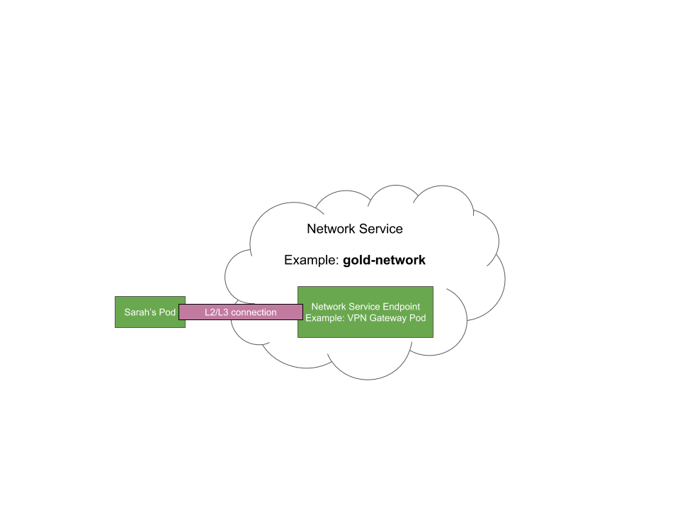
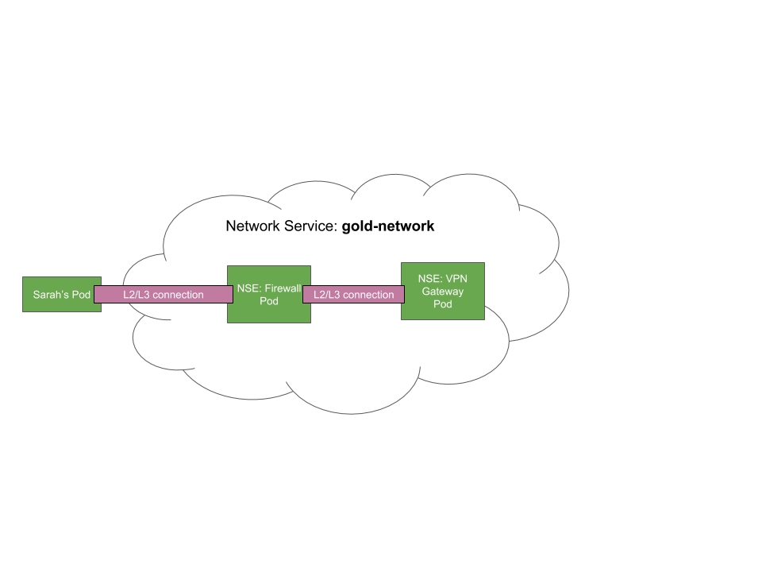

This document aims at identifying the workflow a network service provider (NSP) would use to dynamically manage a network services (NS) composed of several network service enpoints, thanks to network service wirings (NSW) usage.

The use case is a NSP who wants to provide a gold-network NS, composed by a vpngateway at the begining:

# Deploy the Network Service



To provide the NS, the NSP will first have to
- create the NS with the following k8s object creation:
```
apiVersion: networkservicemesh.io/v1
kind: NetworkService
metadata:
  name: gold-network
spec:
  metadata:
    name: gold-network
    namespace: default
  selector:
    app: vpngateway
```
- deploy the vpngateway as a NSE which registers its capability to provide the gold-network NS by communicating over gRPC with the local NSM.

  Thanks to NSM/API/Dataplane coordination, a cross-connect link will be created between users pods that ask for gold-networks NS and a vpngateway/NSE.

# Change the traffic flow in the Network Service

Now the NSP decides that any traffic from users pods to vpngateways pods must go through a firewall:



To do that, the NSP will have to :

- deploy firewalls pods

   They will register themselves as gold-network NSE. Those firewalls will then expose the gold-network NS, but they will also consume the gold-network NS by requiring connectivity to a vpngateway pod implemented as a NSE, in order to forward outgoing traffic.

   At this stage, any pod that is asking for gold-network connectivity, will be connected to a vpngateway pod or a firewall pod, since both are registered as gold-network NS implementations. The firewall itself may be connected to another firewall pod, since it is asking for a connection to the gold-network NS.

   To prevent this side effect and have the traffic correctly goes from the users pods to a firewall pod and then to a gateway pod, the NSP will create NetworkServiceWirings objects with the k8s API.

- create Network Service Wirings

  * A first NSW will match any traffic that is targeting a gold-network NS (in our case, users pods and firewall pods), but that is not coming from a pod which implements a gold-network NS (firewalls pods do). It will end up selecting traffic from users pods to any gold-network NS, but not traffic from firewall pods, since they are implementing the NS. Matching traffic will be routed to a pod with the label firewall=true.
```
kind: NetworkServiceWiring
apiVersion: V1
metadata:
    name: gold-network-wiring-1
spec:
    target:
        - gold-network
    qualifiers:
        source:
			sourceService:
			    !gold-network
    action:
   	    route:
	        -destination:
		         podSelector:
				     firewall=true
```

  * A second NSW will match any traffic that is targeting the gold-network NS, but that is coming from a pod with the label firewall=true. This traffic will be directed to a pod with vpngateway=true:
```
kind: NetworkServiceWiring
apiVersion: V1
metadata:
    name: gold-network-wiring-2
spec:
    target:
        - gold-network
    qualifiers:
        source:
			podSelector:
			    firewall=true
    action:
		route:
	        -destination:
				 podSelector:
				     vpngateway=true
```

# Alternatives

A simpler approach would be to explicitly mention an ordered list of NSE the traffic has to follow when consuming the NS. It could be mentioned as a list of app label in the selector section of the NetworkService:
```
apiVersion: networkservicemesh.io/v1
kind: NetworkService
metadata:
  name: gold-network
spec:
  metadata:
    name: gold-network
    namespace: default
  selector:
    app:
    - firewall
    - vpngateway
```

This would allow the NSP to only update the NS object with the k8s API when the traffic flow needs a change.

Each time a user's pod wants to consume the gold-network NS, a new circuit will be created with cross connects between the pod/firewall/vpngateway.
