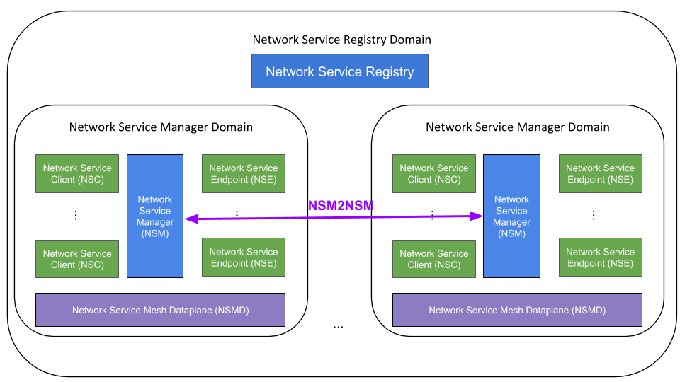
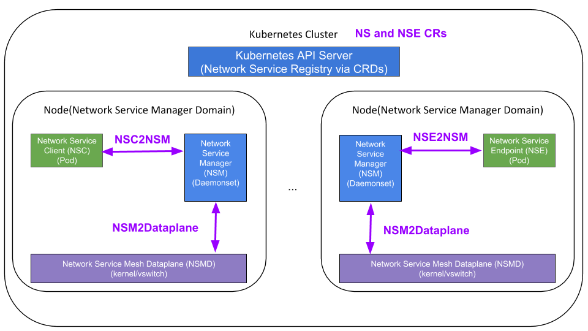
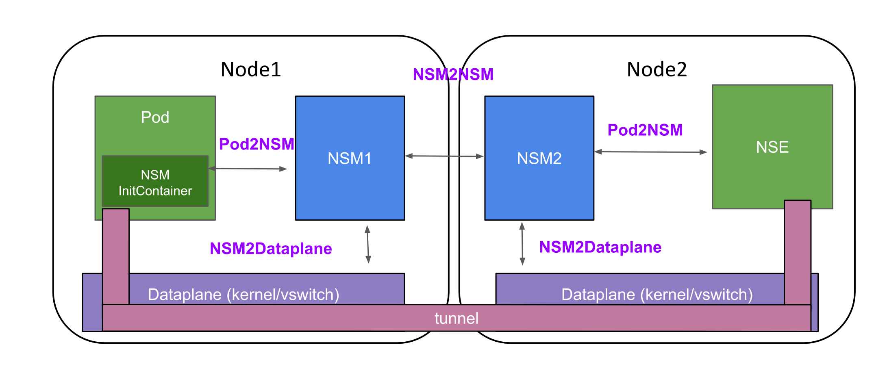

Network Service Mesh (NSM) API

## Executive summary

Based on the discussions on NSM IRC channel on September 11th/12th and in the issue [https://github.com/ligato/networkservicemesh/issues/283](https://github.com/ligato/networkservicemesh/issues/283). This document describes API calls between different components in NSM enabled kubernetes cluster. Each type of API is provided with proto file definition and brief description of parameters expected and returned. Developers of NFVi who plan to leverage NSM for their applications, are urged to thoroughly review these API calls to make sure that expected and returned parameters do fully cover their applications&#39; needs.


## List of Network Service Mesh Components

### Network Service Mesh Components in the Abstract

Current Network Service Mesh is highly focused on Network Service Mesh within the context of a Kubernetes Cluster.  Most of this document will work within that context.
Network Service Mesh concepts are highly genericizable.


<dl>
    <dt>Network Service (NS)</dt>
    <dd>
        A Network Service is the abstract representation of the various behaviors to be provided to a Network Service Client via an L2/L3 connection.  It can include:
        <ul>
            <li>Connectivity to Isolated Resources</li>
            <li>Protection for Threats</li>
            <li>Guaranteed Bandwidth/Latency</li>
            <li>Load Balancing</li>
            <li>Proxying</li>
        </ul>
        A Network Service has a name and a payload.  The payload defines the type of L2/L3 payload (Ethernet/IPv4/IPv6/MPLS/etc) the Network Service accepts.
        Examples:
        <ul>
            <li>Secure Intranet Access</li>
            <li>Bride Domains</li>
            <li>Routing Domains (VRFs)</li>
            <li>Cloud-native Network Functions (CNFs) of all sorts</li>
        </ul>
    </dd>
    <dt>Network Service Client (NSC)</dt>
    <dd>
        A Network Service Client is an entity which wishes to connect to a Network Service.  
        Example: A Pod in Kubernetes which wants to connect to a Network Service.
    </dd>
    <dt>L2/L3 Connection</dt>
    <dd>
        An L2/L3 Connection is simply some mechanism which can carry L2/L3 traffic (IP/Ethernet/MPLS/etc) bidirectionally between the Network Service Client and the Network Service Endpoint.  L2/L3 Connections are simple cross connects.  They are not bridge domains.  A bridge domain is itself a Network Service, and can be connected to via an L2/L3 Connection.
    </dd>
    <dt>Network Service Endpoint (NSE)</dt>
    <dd>
        A Network Service Endpoint provides a concrete usable instance of a Network Service for consumption by Network Service Clients.  Example: Pods providing a Network Service in Kubernetes.
    </dd>
</dl>


<dl>
    <dt>Network Service Dataplane (NSD)</dt>
    <dd>
        Within the Network Service Manager domain, the Network Service Dataplane is the dataplane managed by the Network Service Manager to 
        <ul>
            <li>Connect Network Service Clients in its domain to Network Service Endpoints.  The Network Service Endpoints need not be in the Network Service Managers domain.</li>
            <li>Connect Network Service Endpoints in its domain to Network Service Clients.  The Network Service Clients need not be in the Network Service Managers domain, nor within any Service Registry Domain that the Network Service Manager participates in.</li>
        <ul>
    </dd>
    <dt>Network Service Manager (NSM)</dt>
    <dd>
        A Network Service Manager (NSM) manages a collection of Network Service Clients, Network Service Endpoints, and the Network Service Dataplane for those NSCs and NSEs within its Network Service Manager Domain.  An example of a Network Service Manager Domain would be a single Kubernetes Node.  A Network Service Manager is responsible to
        <ul> 
            <li>Advertise Network Service Endpoints in its domain to zero or more Network Service Registries</li>
            <li>Establish L2/L3 Connections directly between Network Service Clients in its domain and Network Service Endpoints in its domain.
            <li>Collaborate with other Network Service Managers discovered via one or more Network Service Registries to establish L2/L3 Connections between Network Service Clients in its domain and Network Service Clients in another Network Service Manager's domain.</li>
            <li>Collaborate with other Network Service Managers to establish L2/L3 Connections between Network Service Endpoints in its domain and Network Service Clients in abother Network Service Manager's domain.
        </ul>
    </dd>
    <dt>Network Service Registry (NSR)</dt>
    <dd>
        A Network Service Registry is used to register:
        <ul> 
            <li>Network Services</li>
            <li>Network Service Endpoints</li>
        </ul>
        A Network Service Registry allows Network Service Managers to advertise and find each others Network Service Endpoints within its Network Service Registy Domain.
        An example of a Network Service Registry would be Network Service CRs and Network Service Endpoint CRs stored in the Kubernetes API server for a Kubernetes Cluster.
    </dd>
</dl>

### Network Service Components in Kubernetes


Within the context of Kubernetes:

- The Kubernetes Cluster is a **Service Registry Domain**, with CRs for Network Service and Network Service Endpoint stored in the Kubernetes API Server as a Service Registry.
- Each **Node** is a **Network Service Manager Domain** with its own **Network Service Manager** running as a daemonset.
- **Network Service Clients** and **Network Service Endpoints** running within the Kubernetes Cluster are **Pods**, running on a **Node**.
- The **Network Service Manager** for a **Node** utilize one or more **Network Service Dataplanes**.  Examples: VPP, Kernel, etc.
- The **Network Service Manager** for a **Node** must be able to facilitate a **Network Service Client** (Pod) or **Network Service Endpoint** (Pod) initiating/accepting an L2/L3 Connection throughout their lifecycles, not just at Pod startup time.

#### (Non-)Interaction with CNI

Network Service Mesh is orthogonal to CNI and normal Kubernetes Networking.  It must not interfere with or impede normal Kubernetes Networking functionality.

## Network Service Mesh APIs

### Network Service Mesh APIs in the Abstract

In the abstract, the APIs that an Network Service Manager uses to communicate with the Network Service Clients, Network Service Endpoints, and Network Service Dataplanes in its Network Service Manager Domain can be anything that works well within that Network Service Manager Domain.  It is expected that over time, standards for particular kinds of Network Service Manager Domains will emerge.  In subsequent sections, this document will define such a standard for Network Service Managers within the domain of a Kubernetes Node.  

Additionally, the mechanisms for Network Service Registries in a Network Service Registry domain can also be whatever works for that Network Service Registry Domain and the Network Service Managers within it.  In subsequent sections, this document will define such a standard for Network Service Registries for Kubernetes Clusters.

This means that in the abstract Network Service Mesh has:
- A concrete Network Service Manager to Network Service Manager API
- A logical Network Service Registry API - that information that must be stored in the Network Service Registry so Network Service Managers function.

#### Network Service Manager to Network Service Manager (NSM2NSM) API



The Network Service Manager API is defined in protobuf for communication over grpc.

In this message Client&#39;s local NSM (hereafter called NSM1) proxying Network Service request to NSE&#39;s local NSM (hereafter called NSM2). NSM1 and NSM2 have to negotiate:

<dl>
    <dt>RemoteConnectionMechanism</dt>
    <dd>The 'mechanism' (usually, but not necessarily a tunnel type and tunnel parameters) for the L2/L3 connection between the NSMs local dataplanes.</dd>
    <dt>ConnectionContext<dt>
    <dd>The L2/L3 Connection has 'context'.  Context includes addressing and routing information **for the L2/L3 connection**.</dd>
</dl>

The common pattern for negotiation of all of these matters between a NSM1 and NSM2 is:
1. NSM1 communicates preferences and constraints
2. NSM2 makes selections which meet those selections and constraints, or rejects the connection.

```proto

service NSM2NSM {
    rpc RequestRemoteConnection(RemoteConnectionRequest) returns RemoteConnectionResponse;
}

/*
 *  RemoteConnectionRequest is sent from one NSM1 to NSM2 to seek to establish an L2/L3 connection to an NSE
 *  being 'managed' by NSM2 on behalf of an NSC being managed by NSM1.  
 *
 *  request_id - id for the request, should be unique between NSM1 and NSM2
 *  network_service_name - the name of the network service NSM1 is seeking to connect to
 *  network_service_endpoint_name - the name of the network service endpoint NSM1 is seeking to connect to
 *  nse_name - the name of the nse we are seeking a request to.  This should match the name in the 
 *             Network Service Registry for the NSE
 *  labels - labels to communicate arbitrary context around the request
 *  remote_mechanisms - a list of remote mechanisms that can be used for the L2/L3 connection.
 *                           The list should be interpreted with descending order of priority.  NSM2 should
 *                           Seek to provide the highest priority remote mechanism it can.
 */
message RemoteConnectionRequest {
   string request_id = 1;
   string network_service_name = 2;
   repeated RemoteMechanism remote_mechanisms = 3;

   /* fields below here are optional */
   ConnectionContextRequest connection_context_request = 4;
   string nse_name = 5;
   map<string,string> labels = 6;
}

/* 
 * RemoteMechanism defines a request for a particular remote mechanism
 *
 * type   - type of remote mechanism being requested
 *
 * labels - a set of key value pairs that can be used
 *                       to describe parameters or constraints on parameters
 *                       for the RemoteMechanism
 *
 * Example:
 *          VXLAN - would have labels src_ip, src_port, dst_ip, dest_port, vni, vnis
 *                  when NSM1 sends a RemoteConnectionRequest to NSM2, it would specify
 *                  src_ip, src_port, and vnis.  vnis is a range constructed list of
 *                  vnis that could be used by NSM2 with this src_ip and src_port.
 *                  vnis = 1-100, 200-450
 *                  when NSM2 sends a RemoteConnectionReply, it would specify
 *                  use the src_ip, src_port from the RemoteConnectionRequest,
 *                  specify its own dst_ip, dst_port, and pic from the presented vnis
 *                  the vni to be used
 *                  vni=12
 *                  
 */
message RemoteMechanism {
    RemoteMechanismType type = 1;
    map<string,string> labels = 2
}

/* 
 *  Initial attempt to define remote mechanism types.  Very preliminary
 */
enum RemoteMechanismType {
    NONE = 0; // For use when connection is not accepted
    VXLAN = 1;
    VXLAN_GPE = 2;
    GRE = 3;
    SRV6 = 4;
    MPLSoEthernet = 5;
    MPLSoGRE = 6;
    MPLSoUDP = 7;
}

 /*
  *  ConnectionContextRequest - Constraints to put on ConnectionContexts
  *
  * connection_addressed - true if the NSC needs an address
  * excluded_prefixes - prefixes which cannot be used in the context of the connection, including prefixes to route to the connection
  *                     and addressing on the connection
  * additional_prefix_request - request for blocks of additional addresses
  * 
  */
message ConnectionContextRequest {
    bool connection_addressed = 1;

    /* fields below are optional */
    repeated Prefix excluded_prefixes = 2;
    repeated PrefixRequest additional_prefix_requests = 3;
}

/*
 * PrefixRequest - request for additional prefixes
 *
 * address_family - address family of address being requested
 * len - len of requested prefix 
 *
 * TODO: We need to find a better name here than PrefixRequest since its used in Prefix 
 *
 */ 
message PrefixRequest {
    int32 address_family = 1; // See https://www.iana.org/assignments/address-family-numbers/address-family-numbers.xhtml
    int64 len = 2;
}

/*
 * Prefix - address prefix
 */
message Prefix {
    PrefixRequest prefix_request = 1;
    bytes prefix = 2;
}

/* 
 * RemoteConnectionReply - response sent from NSM2 to NSM1 in response to a 
 *                         RemoteConnectionRequest
 * request_id - Request id sent by NSM1 to NSM2 in the RemoteConnectionRequest
 *              this is a reply to
 * accepted - true if the connection is accepted, false if the connection is rejected
 * admission_error - optional string representing the error if accepted == false
 * remote_mechanism - the fully specified remote mechanism selected by NSM2
 * labels - key value pairs to communicate arbitrary context about the reply
 */
message RemoteConnectionReply {
    string request_id = 1;
    bool accepted = 2;
    RemoteMechanism remote_mechanism = 3;
    ConnectionContext connection_context = 5;

    /* admission_error may be left at default value if the RemoteConnectionReply has accepted == true */

    string admission_error = 6;

    /* fields below are optional */

    map<string,string> labels = 7;
}

/*
 * ConnectionContext - Context of the connection
 * nsc_connection_addresses - address for the NSC on the connection
 * nse_connection_addresses - address of the NSE on the connection
 * routes - prefixes to be routed from the NSC to the connection
 * additional_addresses - additional addresses provided to the NSC
 *                        must be valid within the context of the connection
 *                        and the network service being provided on that connection
 */
message ConnectionContext {
    Prefix nsc_connection_addresses = 1;
    Prefix nse_connection_addresses = 2;
    repeated Prefix routes = 3;
    repeated Prefix additional_addresses = 4;
}
```

#### Logical Structure of Network Service Registry Entries

It is expected that initially, and possibly always, the major implementation of the Network Service Registry will be done with Custom Resources (CRs) in Kubernetes.  It is desireable that it be logically possible to have other Network Service Registry implementations.  To facilitate this, it is necessary to describe the minimum shell of information needed in the the Network Service Registry.

The Network Service Registry contains two kinds of entries:

- Network Service (NS)
- Network Service Endpoint (NSE)

A Network Service must minimally have the following information:

<dl>
    <dt>Name<dt>
    <dd>The name of the Network Service.  This must be non-empty and unique within the Network Service Registry at any given moment in time.
    <dt>Payload<dt>
    <dd>The type of L2/L3 payload the Network Service accepts.  Examples include but are not limited to Ethernet, IPv4, Ipv6, IP (implied to be both IPv4 and IPv6), MPLS.  This value must be non-empty.</dd>
</dl>

A Network Service Endpoint must miniminally have the following information:

<dl>
    <dt>Name</dt>
    <dd>The name of the Network Service Endpoint.  This must be non-empty and unique within the Network Service Registry at any given moment in time.</dd>
    <dt>Network Service Name<dt>
    <dd>The name of the Network Service the Endpoint provides.  This must be non-empty.</dd>
    <dt>Network Service Manager ip:port</dt>
    <dd>The ip and port used to contact the Network Service Manager that manages the Network Service Endpoint. This information must be provided.</dd>
    <dt>Labels<dt>
    <dd>A map of key value pairs, with both keys and values being strings.  It is acceptable to have no keys/value pairs in the labels field.  A Network Service Endpoint does not have to have any labels, but a Network Service Registry must have the ability for Network Service Endpoints to have labels.</dd>
</dl>

It is important to remember that a given entity (example: Pod) may expose multiple Network Services.  In the event a particular entity (example: Pod) exposes multiple Network Services, this results in multiple Network Service Endpoint entries in the Network Service Registry.

It is possible for a given entity (example: Pod) to expose the same Network Service multiple times.  This may be done, for example, to expose the Network Service with different labels.  This should result in multiple Network Service Endpoint entries in the Network Service Registry with different names.

### Network Service Mesh APIs in Kubernetes

Network Service Mesh in Kubernetes uses the standard NSM2NSM API as defined above, and provides an implementation of a Network Service Registry via Custom Resources (CRs).  In addition, it has APIs specific to Kubernetes for various components to interact:



<dl>
    <dt>NSC2NSM</dt>
    <dd>Defines how a Pod interacts with a Network Service Manager (NSM) as a Network Service Client (NSC)</dd>
    <dt>NSE2NSM</dt>
    <dd>Defines how a Pod interacts with a Network Service Manager (NSM) as a Network Service Endpoint (NSE)</dd>
    <dt>NSM2Dataplane</dt>
    <dd>Defines how a Network Service Manager (NSM) interacts with a Network Service Mesh Dataplane (NSMD).</dd>
</dl>

#### NSM2Dataplane API

A Network Service Mesh interacts with one or more Dataplanes.  The purpose of the Dataplane is to provide the actual dataplane that does cross connect between the Network Service Client (NSC) and a Network Service Endpoint (NSE).  

A cross connect typically consists of a pair of mechanisms (remote or local).

Examples:
- A Network Service Client (NSC) which is connected to the local mechanism 'kernel interface' is cross connected to a Network Service Endpoint (NSE) via the remote mechanism 'VXLAN'.  This cross connect can be thought of as the pair ('kernel interface','VXLAN')
- A Network Service Client (NSC) which is connected to a local mechanism 'memif' is cross conneted to a Network Service Endpoint (NSE) via a local mechanism 'memif' if they are both on the same Node.  This cross connect can be thought of as a pair ('memif','memif').
- A Network Service Client (NSC) which is connected to a local mechanism 'memif' is cross connected to a Network Service Endpoint (NS) via the local mechanism 'kernel interface'.  This cross connect can be thought of as the pair ('memif','kernel interface')

```proto

service NSM2NSMD {
    rpc CreateCrossConnnect(CrossConnect) returns CrossConnectStatus;
    rpc UpdateCrossConnect(CrossConnect) returns CrossConnectStatus;
    rpc DeleteCrossConnect(CrossConnect) returns CrossConnectStatus;
    rpc ListAndwatchCrossConnects(Empty) returns (stream CrossConnectStatus)
    rpc ListAndWatchMechanisms(Empty) returns (stream Mechanism)
}

/*
 * CreateCrossConnectRequest - Message to create a a CrossConnect
 *
 * Its helpful to think of a cross connect like a wire that carries
 * a particular payload from one place to another bidirectionally.
 * You can talk about that in terms of the pair of 'mechanisms' at either end.
 * Examples:
 *           (kernel interface, kernel interface)
 *           (kernel interface, memif)
 *           (memif, memif)
 *           (memif, vxlan)
 *           (memif, srv6)
 *
 * id         - id of the cross connect.  Must be unique in the context of this NSM and NSMD.
 *              id is selected by the NSM.
 * mechanism1 - A Cross Connect has two ends, each with a 'Mechanism'.  This is one of them.
 * mechanism2 - A Cross Connect has two ends, each with a 'Mechanism'.  This is one of them.
 */ 
message CrossConnect {
    string id = 1;
    Mechanism mechanism1 = 2;
    Mechanism mechanism2 = 3'
}

/* 
 * Mechanism - A simple message that can be oneof LocalMechanism or RemoteMechanism
 */
message Mechanism {
    oneof mechanism {
        RemoteMechanism remoteMechanism = 1;
        LocalMechanism localMechanism = 2;
    }
}

/* 
 * CrossConnectStatus - Status of a CrossConnect
 *
 * id     - id of the CrossConnect
 * labels - key value pairs that can be used to convey operational data
 *          about the cross connect.  Possible examples: stats, up/down state, health, etc
 * TODO - flesh out the lexicon of status labels
 */
message CrossConnectStatus {
    string id = 1;
    map<string,string> labels = 2;
}

/*
 * LocalMechanism - the mechanism used locally with a Pod to provide one end
 *                  of an L2/L3 connection
 * type           - The type of local mechanism.
 *                  Examples: memif, kernel interface, vhost-user
 * labels         - labels are key value pairs used to indicate parameters
 *                  labels can be used to express preferences or constraints,
 *                  or they can be used to communicate final values of a
 *                  parameter.
 *                  Examples:
 *                      - For a LocalMechanism of type KERNEL_INTERFACE
 *                        the label "name=eth2" indicates the desired or 
 *                        actual name of the interface to be injected into
 *                        the Pod
 * TODO - fully document and specify all valid labels for each type
 */
message LocalMechanism {
    LocalMechanismType type = 1;
    map<string,string> labels = 1;
}

enum LocalMechanismType {
    KERNEL_INTERFACE = 0;
    MEMIF = 1;
    VHOST_USER = 2;
}

service NSMD2NSM {
    rpc Registration(RegisterRequest) return (Empty)
}

message RegisterRequest {
    // Version of the API
    string version = 1;
    // Name of the unix socket the device plugin is listening on
	// PATH = path.Join(NSMDPath, endpoint)
    string endpoint = 2; 
}

```

--------------------

NSM consists of multiple components which interact between each other with a purpose of establishing connectivity requested by a user application for example: secure gateway, or L2 connectivity or some other form of connectivity. Here is the list of identified components:

- Network Service Mesh Client (NSMc), currently existing in form of a sidecar container, an application requesting connectivity on behalf of main application container running in the pod.
- NSM process, runs as a daemonset on each compute node in the kubernetes cluster providing endpoints for applications methods to request a specific type of connectivity or to advertise its capabilities.
- Network Service Endpoint (NSE), an application advertising its ability to provide one or more specific Network Service (NS) and some specific connections parameters.
- eNSM is NSE that is external to the kubernetes cluster. E.g. an SDN may choose to implement an eNSM and manage the endpoints in their product rather than land a pod in K8s.

In a simplified form, the flow starts with NSM client requesting a specific type of connectivity or Network Service (NS) from its local NSM. Local NSM attempts to find local or remote NSE which offers NS requested by the client. After a series of API calls between local NSM and remote NSM and between NSM and NSE (details are provided in following sections), the requested connectivity on behalf of NSM client gets established.

The following diagram gives visual representation of the flow:



## List of identified API calls

### NSM Client to its local NSM
- Connection request
- Connection reply

### NSE to its local NSM
- Endpoint Advertise Request
- Endpoint Advertise Reply

### NSE to its local NSM
- Endpoint Remove Request
- Endpoint Remove Reply

### Local NSM to remote NSM   **Currently not implemented**
- Proxy Connection request
- Proxy Connection reply

### Local NSM to NSE
- Endpoint Connection Request
- Endpoint Connection Reply


### NSM client requesting Network Service from its local NSM

Connectivity between NSM client and NSM daemoset occurs over a linux named socket which gets injected into the client pod at the startup time.

- Connection Request

```proto
message ConnectionRequest {
    string request_id = 1;
    string network_service_name = 2;
    string linux_namespace = 3;
    repeated common.Interface interface = 4;
}
```
**Where:**

**request\_id** is POD UID which is unique and immutable identifier existing throughout POD&#39;s life.

**network\_service\_name** represents a network service/application, a client pod desires to connect to.

**linux\_namespace**  contains the name of POD&#39;s linux namespace, it is required for injecting additional interfaces.

**interface list** defines supported/desired by POD connectivity types.

**Note:** Interface structure also defined as a protobuf, for details see Appendix:

- Connection Reply

NSM Client connection reply message  is returned to inform the client if its request to NetworkService is successful or not.

```proto
message ConnectionReply {
    bool accepted = 1;
    string admission_error = 2;
    ConnectionParameters connection_parameters = 3;
    common.Interface interface = 4;
}
```
**Where:**

**accepted** true will indicate that the connection is accepted, otherwise false

**admission\_error** will provide details why connection was refused.

**interface** will indicate the selected/negotiated interface type

**connection\_parameters** will provide interface specific parameters which the client is expected to parse and use.


### NSE to its local NSM

NSE is the actual provider of a network service, to make aware NSM of the service and some specific service parameters, NSE uses EndpointAdvertiseRequest message. Depending on NSE application.  NSM confirms acceptance of the advertisement in EndPointAdvertiseResponse message.

- Endpoint AdvertiseRequest message

```proto
message EndpointAdvertiseRequest {
    string request_id = 1;
    netmesh.NetworkServiceEndpoint network_endpoint = 2;
}

message NetworkServiceEndpoint {
    string network_service_name = 1;
    string network_service_host = 2;
    string nse_provider_name = 3;
    string socket_location = 4;
    repeated common.Interface interface = 5;
}
```
**Where:**

**network\_service\_name** defines a name of the network service NSE supports

**network\_service\_host** defines a name of a host where NSE runs

**nse\_provider\_name** specifies NSE pod's unique ID

**socket\_location** informs NSM about linux named socket it has to use to communicate with NSE for connection requests

- Endpoint AdvertiseReply message

With this message, local to NSE's NSM confirms successful registration and advertisement of a Network Service provided by NSE. In case of an error, **admission_error** will have more details for the cause of a failure.

```proto
message EndpointAdvertiseReply {
    string request_id = 1;
    bool accepted = 2;
    string admission_error = 3;
}
```
**Where:**

**request\_id** is POD UID which is unique and immutable identifier existing throughout POD&#39;s life.

**accepted** true will indicate that the connection is accepted, otherwise false

**admission\_error** will provide details why connection was refused.


- Endpoint RemoveRequest message

This message is sent by NSE to inform its local NSM that it does not provide corresponding Network Service and NSM needs remove previously created Network Service Endpoint Custom Resource.

```proto
message EndpointRemoveRequest {
    string request_id = 1;
    netmesh.NetworkServiceEndpoint network_endpoint = 2;
}
```
**Where:**

**request\_id** is POD UID which is unique and immutable identifier existing throughout POD&#39;s life.

**network\_endpoint** is endpoint which NSM needs to remove.


- Endpoint RemoveReply message

With this message, local to NSE's NSM confirms successful removal of Network Service Endpoint custom reosurce.

```proto
message EndpointRemoveReply {
    string request_id = 1;
    bool accepted = 2;
    string admission_error = 3;
}
```

### Local NSM to remote NSM not yet implemented

When NSM local to NSM client discovers that NSE providing requested Network Service is not local, **network_service_host** in NSE custom resource object does not match the local NSM name, local NSM attempts to proxy client's request to remote NSM. gRPC over well known TCP socket is used for NSM to NSM communication. This method supports as "in-cluster" mode when NSM pod's DNS named is used as "out-of-cluster" when routable IP of external NSM is used to establish TCP connection. In order to facilitate NSM discovery for "in-cluster" mode, each NSM creates a kubernetes **Service** object with matching to NSM daemonset name. For each **Service**, a corresponding DNS entry is automatically created
making discovery of any "in-cluster" NSM flexible and independent of NSM ip address changes.   

- Proxy Connection request

In this message Client&#39;s local NSM proxying Network Service request to NSE&#39;s local NSM.  2 NSMs need to agree upon a tunneling technology supported by both, hence a list of tunnel types is a part of the request message.

```proto
message ProxyConnectionRequest {
    string request_id = 1;
    string network_service_name = 2;
    string nse_provider_name = 3;
    repeated common.Tunnels tunnel_type = 4;
}
```
**Where:**

**request\_id** is NSM POD UID which is unique and immutable identifier existing throughout POD&#39;s life.

**network\_service\_name** represents a network service/application, a client pod desires to connect to.

**nse\_provider\_name** specifies NSE name, NSM used it to differentiate between multiple NSEs providing the same service

**tunnel\_type list** defines supported by NSM POD tunnel types.

- Proxy Connection reply

After completing control plane signalling, programming of the dataplane for NSE pod and setting up a NSM to NSM tunnel endpoint, NSE&#39;s NSM responds to Client&#39;s NSM with Proxy Connection reply message.

```proto
message ProxyConnectionReply {
    string request_id = 1;
    bool accepted = 2;
    string admission_error = 3;
    common.Tunnel tunnel = 4;
}
```
**Where:**

**accepted** true will indicate that the connection is accepted, otherwise false

**admission\_error** will provide details why connection was refused.

**interface** will indicate the selected/negotiated tunnel type

### Local NSM to NSE

NSM communicates with NSE to request a services on behalf of some NSM client. The communication occurs over a linux named socket exposed and advertised by NSE in its Endpoint Advertise Request. NSE replies NSM with some parameters NSM needs to program dataplane connection.

- Endpoint Connection Request

```proto
message EndpointConnectionRequest {
    string request_id = 1;
    string network_service_name = 2;
}
```
**Where:**

**request\_id** is used for idempotency, to prevent any duplicate actions on the same request.

**network\_service\_name** is the name of network service requested on behalf of some NSM Client.

- Endpoint Connection Reply

NSM&#39;s responsibility not just complete control plane signaling but also program a dataplane connection so NSM client would have a dataplane connectivity up to the NSE which provides requested network service. In the Endpoint Connection Reply message NSE returns to NSM necessary information to accomplish it.

```proto
   message EndpointConnectionReply {
       string request_id = 1;
       string network_service_name = 2;
       string linux_namespace = 3;
   }
```
**Where:**

**request\_id** is used for idempotency, to prevent any duplicate actions on the same request.

**network\_service\_name** is the name of network service requested on behalf of some NSM Client.

**linux\_namespace** contains the name of NSE POD&#39;s linux namespace, it is required for injecting additional interfaces.


## Appendix: Definitions of additional protobuf structures

```proto

message InterfaceParameters {
  map <string,string> interface_parameters = 1;
}
```
**Where**

**interface\_parameters** is a map, used to provide specific to an interface type key/value information. It used in different messages.

```
message Interface {
  InterfaceType type = 1;
  InterfacePreference preference = 2;
  InterfaceParameters parmeters = 3;
}

enum InterfaceType {
   DEFAULT_INTERFACE = 0;
   KERNEL_INTERFACE = 1;
   VHOST_INTERFACE = 2;
   MEM_INTERFACE = 3;
   SRIOV_INTERFACE = 4;
   HW_INTERFACE = 5;
 }

enum InterfacePreference {
   NO_PREFERENCE = 0;
   FIRST = 1;
   SECOND = 2;
   THIRD = 3;
   FORTH = 4;
   FIFTH = 5;
}

message Tunnel {
    TunnelType type = 1;
}

enum TunnelType {
    DEFAULT_TUNNEL = 0;
    VXLAN = 1;
    GRE = 2;
    VXLAN_GRE = 3;
    MPLSoGRE  = 4;
    MPLSoUDP  = 5;
    MPLSoEthernet = 6;
}

message ConnectionParameters {
  map <string,string> connection_parameters = 1;
}
```
**Where**

**connection\_parameters** is a map, used to provide connection specific key/value information to NSM client in a connection reply message. Depending on type of accepted connecion, keys/values could carry different information.