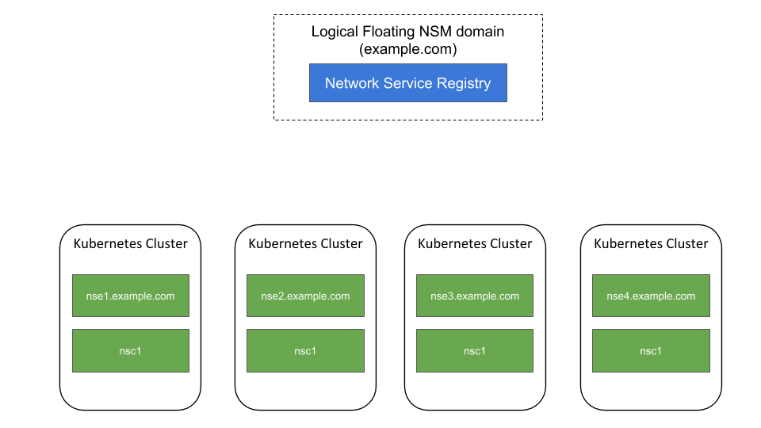
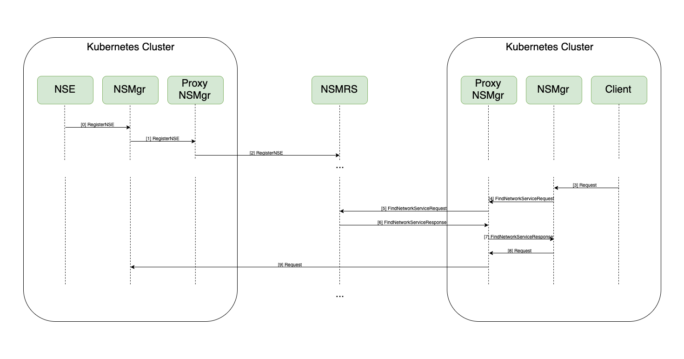

Interdomain NSM
============================

Specification
-------------

Interdomain provides an ability for the Client in one domain to consume a Network Service provided by an Endpoint in another domain.

Implementation details
---------------------------------

1. First, the Client asking for a Network Service with a name of the form: "network-service@example.com"

2. Then the NSMgr sends the registry calls to find the NetworkService Endpoints for the Network Service to the proxy NSMgr in that domain.

3. Proxy NSMgr resolves domain name via DNS and sends a GRPC Request to the remote domain NSMgr to find NetworkService Endpoints for the Network Service

4. Client's NSMgr negotiate the 'remote.Mechanism' with remote domain NSMgr through the proxy NSMgr in Client's domain.

5. Both sides setup their end of the tunnel.
    *  Client's NSMgr initiate connection monitoring via proxy NSMgr for the death and healing purposes

Client and endpoint nodes has to have public ipv4 addresses and have to be reachable by each other.

All remote mechanisms supported by NSM are also suported by Interdomain NSM.

Interdomain NSM does not have central registry. All clusters are communicate just within each single connection.

Network service can be reached by ipv4 format address and domain name. Currently domain name will be resolved by local DNS resolver and can be changed to any custom resolver ([func ResolveDomain(remoteDomain string)](../../k8s/pkg/utils/interdomainutils.go)).

Floating Interdomain
------------------------

Floating interdomain provides an ability to search for Network Service in several domains using one request.

* NSMRS (Network Service Mesh Registry Server) keeps a list of Network Service endpoints from several domains. 
* Network Service Registry forwards RegisterNSE request to Proxy NSMD-K8S. If Proxy NSMD-K8S has configured NSMRS, it will forward received RegisterNSE requests to the NSMRS.
* NSMRS domain should be configured on Proxy NSMD-K8S using Environment variable "*NSMRS_ADDRESS*".
* In order to keep existing Endpoints list at NSMRS, NSMgr sends BulkRegisterNSE request for each Endpoint every 2 minutes (by default) to notify NSMRS that Endpoint is still exists. Set "*NSE_TRACKING_INTERVAL*" environment variable to change notification interval. If NSMRS does not receive notifications for 5 minutes (by default), it removes NSE from registry cache (set "*NSE_EXPIRATION_TIMEOUT*" enviromnent variable on NSMRS to change Endpoint lifetime)
* NSMRS can be used by NSMgr as regular Interdomain request to search Network Service in several domains by one request. For example request for Network Service of the form *network-service@nsmrs-domain.com*.
* NSMRS is independent from kubernetes (except [spire registration](security.md)).
* k8s Node requires specific label to assign NSMRS deployment by Helm chart
> kubectl label nodes \<node-name\> nsmrs=true

Example usage
------------------------

Take a look an example in interdomain integration tests

Interdomain NSM supports and have been checked on Packet, AWS, AZURE and GKE clusters. 

References
----------

* Issue(s) reference - https://github.com/networkservicemesh/networkservicemesh/issues/714
* PR reference - https://github.com/networkservicemesh/networkservicemesh/pull/1298