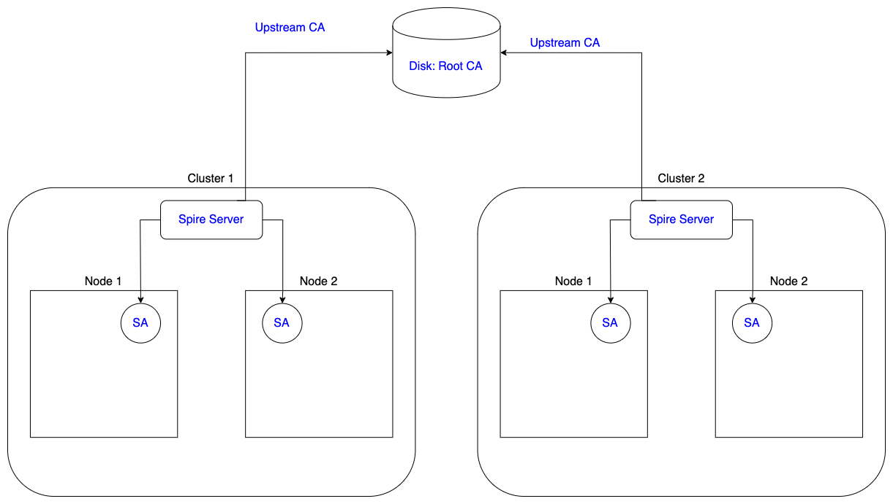

# Interdomain Security

## Current state

### Scheme

Current implementation is quite straightforward. It is based on same Root Certificate Authority.



All Spire Servers across all clusters have the following line in configuration:

```hcl
UpstreamCA "disk" {
    plugin_data {
        ttl = "12h"
        key_file_path = "/run/spire/secret/bootstrap.key"
        cert_file_path = "/run/spire/secret/bootstrap.crt"
    }
}
```

So basically they are share the same trust domain, which is an obvious disadvantage because clusters may belong to different organisations with own PKI.

### CI implementation

We utilize Circle CI for running Intergration tests. There is step `Generating CA` in the `intergration-tests` job:

```yaml
- run:
    name: Generating CA
    command: |
        export CA_DIR=./deployments/helm/nsm/charts/spire
        ./scripts/generate-ca.sh $CA_DIR
```

That step generates `key.pem` and `cert.pem` and puts them to `$CA_DIR`. Then files are put to the `spire-secret` during installation spire with `helm`.

## SPIFFE Federations

### Overview

Since _v0.8.1_ Spire has experimental support of SPIFFE federations. This feature allows you to configure mutual authentication across different trust domains. In order to make it work you have to add `federatesWith` in two places:

- SPIFFE Entry

Adding `federates_with` to SPIFFE Entry means this entry could trust every entry in provided trust domain.

 ```json
 {
    "selectors": [ ... ],
    "spiffe_id": "spiffe://trustdomain1.com/nsmgr",
    "parent_id": "spiffe://trustdomain1.com/spire-agent",
    "federates_with": "spiffe://trustdomain2.com",
}
 ```

- Spire Servre configuration

In order to check that SPIFFE Entry from `trustdomain2.com` belongs to that trust domain for sure, we have to use bundle from `trustdomain2.com`. We also need some way to refresh it. For that purposes we configure access to `trustdomain2.com` spire-server that aware of bundles and might send them to `trustdomain1.com` spire-server.

```hcl
experimental {
        bundle_endpoint_enabled = true
        bundle_endpoint_port = 8443

        federates_with trustdomain2.com {
                bundle_endpoint_address = trustdomain2.com
                bundle_endpoint_port = 8443
                bundle_endpoint_spiffe_id = "spiffe://trustdomain2.com/spire/server"
        }
}
```

But in order to make the first request to obtain bundle, we already should have bundle of the `trustdomain2.com` spire-server. That exchange might be done manually or using some common trusted registry where spire-server might register itself and update bundles for the first request.

### Federation Server

Before start of NSM on particular cluster all we want to do is confugure the list of trust domain, that we want to federate with. We don't want to care about `bundles` for each trust domain or about specific endpoints address that must be used for refreshing.

### Kind implementation

### CI implementation of federations

TBD
