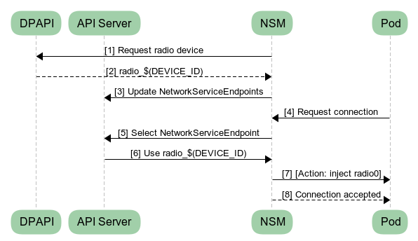
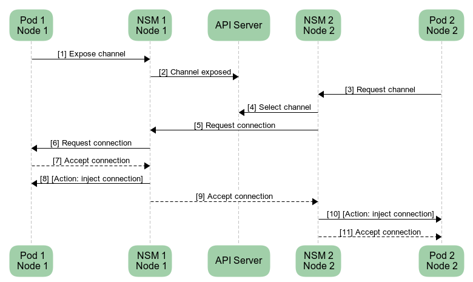
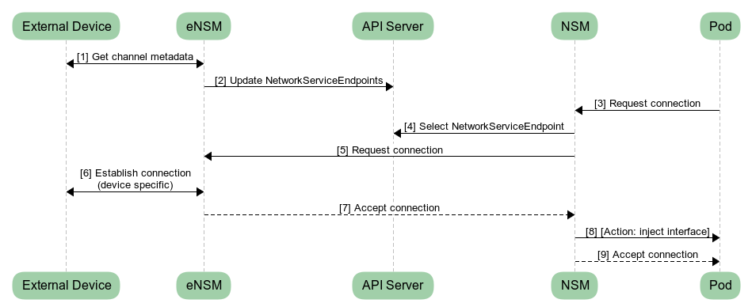
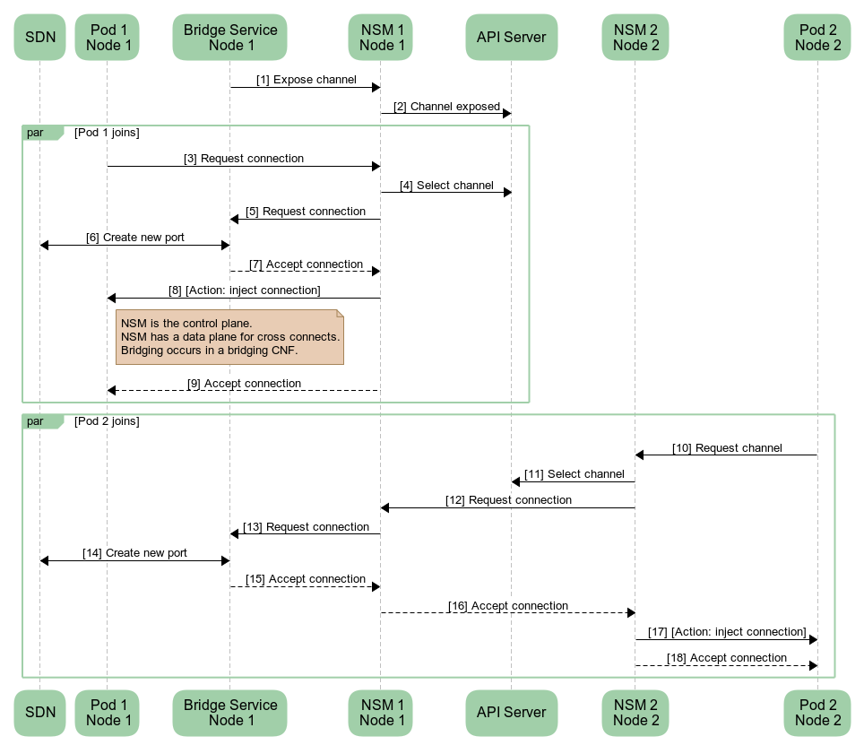
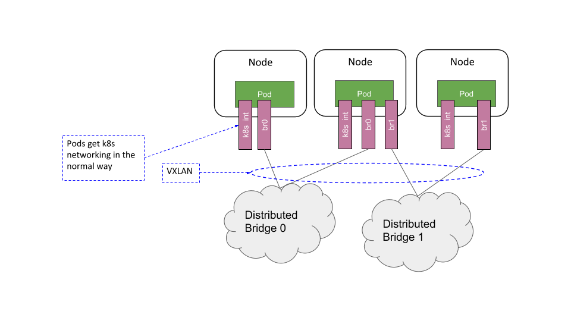
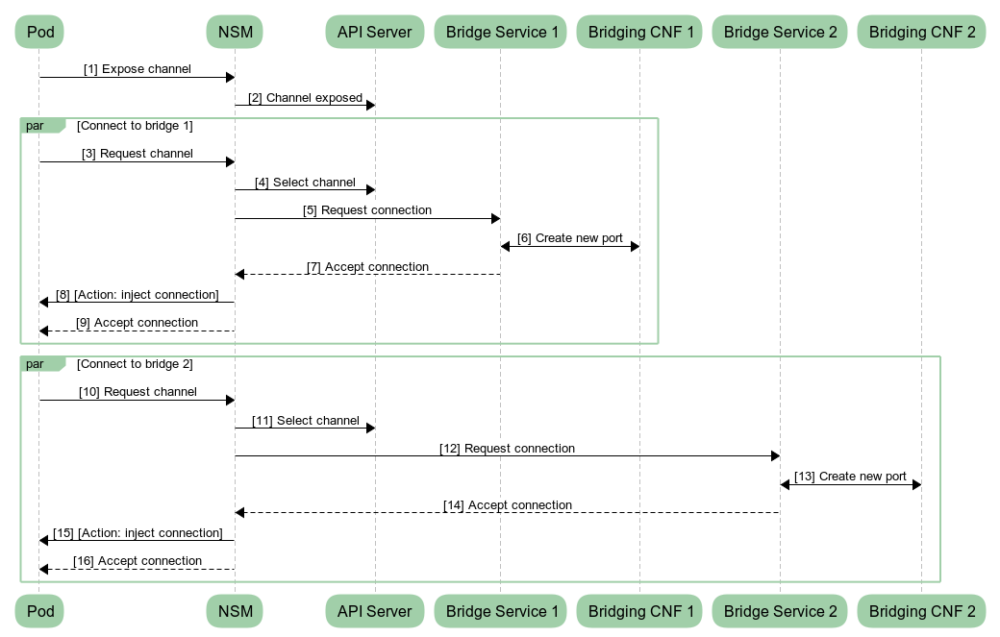

# Network Service Mesh

## Executive Summary

Network Service Mesh (NSM) is a novel approach solving complicated L2/L3 use cases in Kubernetes that are tricky to address with the existing Kubernetes Network Model. Inspired by Istio, Network Service Mesh maps the concept of a service mesh to L2/L3 payloads.

In this document, we cover the problems that Network Service Mesh is solving and guide the user into understanding what Network Service Mesh is through a series of simple examples.

## Problem Statement

Multifaceted networks such as Telcos, ISPs, and advanced enterprise networks are rearchitecting their solutions with the advent of NFV, 5G networks, edge computing, and IoT devices. Each of these technologies brings a significant increase in the total number of connected devices, increased bandwidth available per device, and a significant increase in cloud service load.

Operators of multifaceted networks with advanced L2/L3 use cases currently find container networking solutions ill-suited for their next-generation architecture. Cloud-native solution's lack of support for advanced networking use cases is actively excluding multiple industries from adopting the new cloud-native paradigm.

Current-generation container networking technologies primarily focus on homogenous, low latency, high throughput, immutably deployed, Ethernet/IP, enterprise-centric application clusters. These assumptions do not fit with the needs of telco, ISP, and advanced enterprise networks.

Finally, current cloud-native solutions allow for dynamic configuration of what to deploy, but the realization of that deployment is mostly immutable. CNI concerns itself with only with network allocation during a pod's initialization and deletion phases. The current pattern works for wiring monolithic VNFs together but is an antithesis to the cloud-native paradigm. Merely translating current existing monolithic VNF patterns to cloud-native does not inherently increase the scalability, resiliency, manageability that cloud-native adopters have come to expect. In fact, translating current models may result in a higher total cost of ownership due to the cost of infrastructure refactoring, testing, and training while simultaneously reducing isolation and a higher attack surface.

Realizing the full advantage of the cloud-native paradigm for NFV use cases requires at least two conditions to occur:

* VNFs must be modified or rewritten to mirror the architecture found in 12-factor apps.
* An API should exist that allows the VNF to specify its networking intent through an abstract API dynamically.

When we meet these two conditions, NFV apps may be capable of horizontal scaling while making efficient use of networking resources. When an SDN is involved, the development of NFV apps and SDN may also occur independently due to loose coupling.

## What is Network Service Mesh

Network service mesh (NSM) adds the following properties to networking in Kubernetes:

* Heterogeneous network configurations
* Exotic protocols
* On-Demand, dynamic, negotiated connections
* Tunneling as a first-class citizen
* Networking context as a first-class citizen
* Policy-driven service function chaining (SFC)

A significant important feature of NSM is that it minimizes the need for changes to Kubernetes.

These goals are accomplished using a simple set of APIs designed to facilitate connectivity between containers which are running services or with an external endpoint. New connections negotiate their connection properties. These properties include but are not limited to:

* Type of network interface. e.g. Linux Interface, MemIf, vhost-user
* Payload Type - e.g. Ethernet, IP, MPLS, L2TP

### Example 1 - Request for an Interface

The simplest example is requesting access to an external interface, e.g., a radio network service. Consider a pod which requires access to a network interface. The interface is configured and plumbed into the pod. This scenario may occur either through a dynamic call from a process within the pod or from an init container that sets up the radio service before the main pod container.



NSM also interacts with the Device Plugin API (DPAPI). In this scenario, we interact with a radio service which has a limited number of interfaces. Another use case with a similar pattern is SR-IOV.

For example, suppose we have a set of SR-IOV interfaces managed by DPAPI. The pod spec would request for a device using the limits label. 

```yaml
spec:
  containers:
    - name: ...
      image: ...
      resources:
        limits:
          sriov.nsm.xyz.io: 1
```

When the pod starts, kubernetes injects an environment variable into the pod. In this scenario, it is sriov_$(DEVICE_ID). When the pod connects, the connection claims sriov_$(DEVICE_ID). On success, NSM injects the DPAPI-managed SR-IOV interface into the container.

In both examples, NSM uses DPAPI to ensure device availability while injecting an interface into the pod.

### Example 2 - Connecting two services

Consider an endpoint which requests a tunnel to a network service through an SDN. The network service, SDN, and client negotiate with each other the parameters of the tunnel. Suppose the client is only capable of communicating over a VXLAN tunnel while the network service provides VXLAN and GRE. The negotiation results in a VXLAN tunnel.

Highlighting the dynamic properties of this negotiation is essential. For example, it is possible to negotiate for a shared memory interface if all components support it and both pods are on the same node. If the two pods are on separate nodes, a shared memory instance would be considered unsupported, and another approach would be selected instead.



### Example 3 - External Device

Hooking up an external device is similar to hooking up two network services. The eNSM exposes the device as a network service and is responsible for synchronizing and configuring the device. The eNSM negotiates the connection properties on behalf of the external device and configures the device with the resolved properties once the negotiation is complete.



### Example 4 - L2 Bridge Service

NSM exposes the bridging CNF through a bridge service. The bridge service handles requests to connect to the bridge using the standard NSM patterns as demonstrated in the previous examples.

In this scenario, the Bridge Service is a network service which runs in a pod. The Bridge Service receives the connection requests and configures the data plane to connect the pod to the bridging CNF.



### Example 5 - Distributed Bridge Domain

The distributed bridge domain example is similar to the bridge service shown in Example 4. However, instead of connecting pods to a single bridge, they are connected to multiple bridges.

The SDN(s) manage and provide the pod-to-pod, and bridge-to-bridge interconnects. NSM considers the interconnection data path out of the scope of its responsibilities.

One thing to note is pods still receive their Kubernetes networking interface from CNI. This approach is designed to interoperate with existing Kubernetes patterns while providing additional capabilities when necessary.




